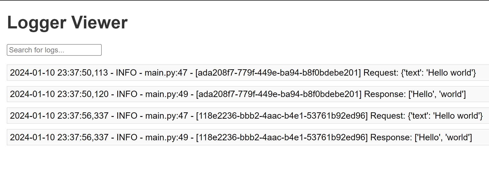

# API Log Viewer

Log Viewer is a simple web application built with FastAPI and JavaScript for viewing and searching through log entries. It provides basic authentication to secure access to log data.

## Features

- View and search through log entries.
- With each new request, a unique GUID is generated and recorded in the logs, facilitating more effective search capabilities.
- Basic authentication to restrict access.
- Responsive design for easy use on different devices.

## Getting Started

### Prerequisites

- Python 3.7 or higher
- FastAPI
- Uvicorn

### Installation

1. Clone the repository:
   ```
   git clone https://github.com/your-username/log-viewer.git
   ```
2. Install dependencies:

   ```
   pip install -r requirements.txt
   
   ```

### Usage

1. Run the FastAPI application:
   ```
   uvicorn main:app --reload
   ```
2. Open your browser and navigate to `http://127.0.0.1:8000/`.

3. Use the provided login form with sample credentials to access the log viewer.

4. Enter search queries in the search input to filter log entries.

## Configuration

- Log entries are read from the `logs/api_log.log` file. Update the log file path in the `view_logs` endpoint if needed.

## Security

- The application uses basic authentication for minimal security. For a production environment, consider implementing more robust authentication mechanisms.

## Screenshot


